# replicAnt

"generating annotated images of animals in complex environments with Unreal Engine"

by [Fabian **Plum**](https://twitter.com/fabian_plum), 
[René **Bulla**](https://twitter.com/renebulla), 
[Hendrik **Beck**](https://twitter.com/Hendrik_Beck), 
[Natalie **Imirzian**](https://twitter.com/nimirzy), 
and [David **Labonte**](https://twitter.com/EvoBiomech) (2023)

___

___

## Retopologising 3D models (subjects)

### Requirements:
* [Blender](https://www.blender.org/) (v3.0.1 or later)
* A 3D model (of whatever takes your fancy, but presumably an animal (hopefully an insect)!) you wish to add to the generator

Behind every great synthetic dataset stands a great 3D model.
We will assume that you already have a model you wish to use.

If you do not, [scAnt - our open source macro 3D scanner](https://github.com/evo-biomech/scAnt), may be a suitable low-cost way to generate high resolution 3D models of small objects. But we are biased here, and plenty other good options exist.

For example, visit [Sketchfab](https://sketchfab.com/EvoBiomech/models) - perhaps, someone just happens to have
uploaded a 3D model of your species.

***
### NOTE
If your desired 3D model already has **< 20,000** polygons, you may be able to skip this step and proceed with the 
[rigging guide](02_Rigging_3D_models.md). 
***

### Important Blender **shortcuts** to make your life (much) easier:

Here are the most important shortcuts to make interacting with blender easier.

Relating to the viewport:

* **Middle Mouse Button**: (*Hold and move your mouse to*) rotate the viewport.

* **Middle Mouse Button + SHIFT**: (*Hold and move your mouse to*) translate the viewport.

* **num-pad keys**: Moves the viewport to a pre-defined position.

The following shortcuts work in any blender panel, so they are useful to remember:

* **G**: Move – move a selected object around. Click the left mouse button to confirm the new position.

* **S**: Scale – scale a selected object up or down. Here, this will help you to adjust the size of the tracking marker.

* **R**: Rotate – rotate a selected object. Adding the rotation of a marker can help retain its identity across frames.

You can also add constraints to the above commands to specify their effect. *After* pressing any of the keys above you can additionally use:

* **X** / **Y** / **Z**: Restrict the axis in which you are performing the action.

* **CTRL**: Jump between whole number steps

* **SHIFT**: Perform the change in finer increments. Helps a lot when making small changes.

You always confirm your change by clicking the **LEFT Mouse Button**.

* And, of course, **CTRL** + **Z** is your friend to revert your last steps. By default, you can go back **32 steps**, but you can increase that number under **Edit/Preferences…/System** menu, if you want to.

For a handy "cheat-sheet", have a look at [Blender 3.0 Shortcuts](https://projects.vrac.iastate.edu/reu2022/wp-content/uploads/Blender-3.0-Shortcuts-v1.2.pdf)

For a "not-so handy HotKeys In-depth Reference", refer to the official [HotKeys In-depth Reference](https://download.blender.org/documentation/BlenderHotkeyReference.pdf)

### Retopologising workflow

The aim of retopologising your model is to reduce its vertex count. Generally, the lower the vertex count, the better - as long as things still appear reasonably realistic. Unreal engine deals very well with large numbers of polygons, but simulating hundreds 
of high resolution meshes is computationally intensive nonetheless. 

Aim for **< 20,000** polygons (triangles) inside your model!

In this example we are going to use a model of a [*Dynomyrmex gigas*](https://skfb.ly/6YYDY), digitised using
[scAnt - our open source macro 3D scanner](https://github.com/evo-biomech/scAnt). The model can be freely downloaded
from [Sketchfab](https://skfb.ly/6YYDY).

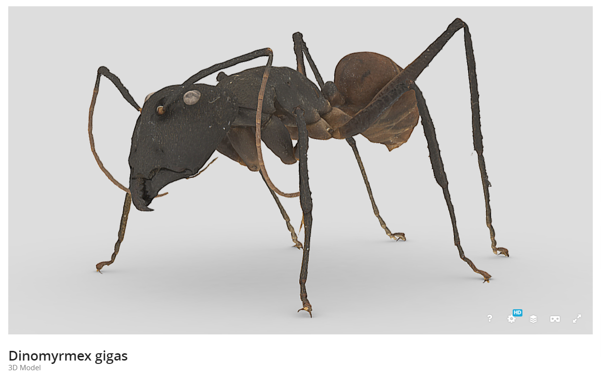

#### Note

When downloading models from Sketchfab, make sure to stick to [Blender](https://www.blender.org/)-compatible file 
formats. In this case, we are going to use the upload-original **.fbx** format.

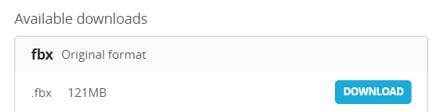

When you extract the downloaded file, you will find two folders inside: one containing the model itself, the other 
containing its textures.

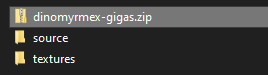

Open [Blender](https://www.blender.org/), clean the workspace, and import the model via **File** > **Import** > 
**FBX (fbx)**

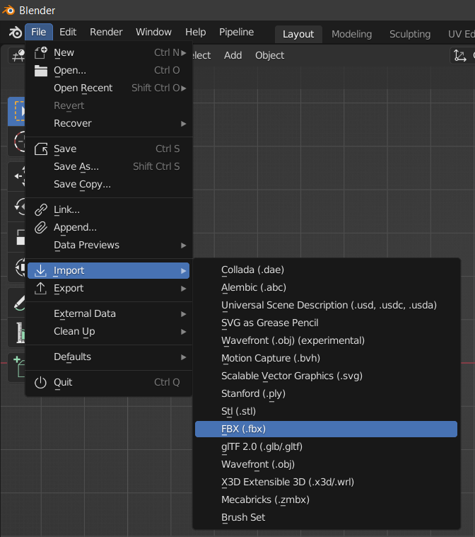

Now you should have loaded the model into Blender. Quickly check the dimensions of the imported model in the
scene tab. This example is scaled correctly, but Blender's internal texture baking sometimes has issues with
very small model sizes. 

You can then simply change the scale of your model (in our case, we increased its scale 100 times) and adjust
its size back to its original dimensions later in Unreal. For ease of handling (if not already the case) move your model
to the centre of the scene. Its origin should be at the centre of the scene and its legs/equivalent should intersect with the
ground plane.

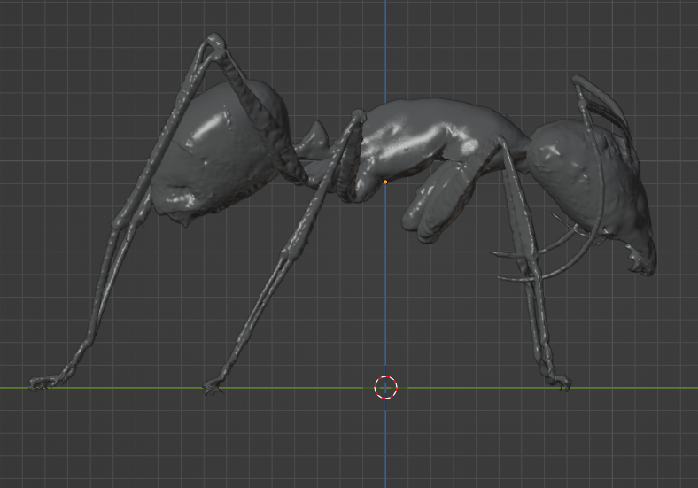

Display the model material to check if all textures have been linked correctly before proceeding.
Press the **Z** key and select **Material Preview**.

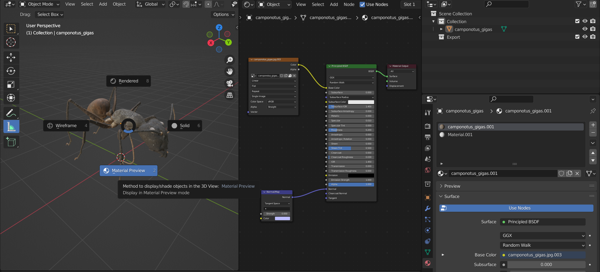

Now we make a copy of our model, which will become the retopologised, low-polygonal version of the original.
Select your model in the viewport and hit **CTRL + C**, **CTRL + V**. Rename the newly copied model
in the **Outliner** to clearly mark which model is which (LP = Low Poly):

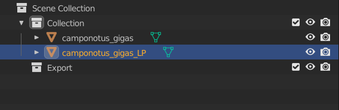

In the **Modifier** tab, add a **Decimate** modifier, selecting **Collapse** as the method.
Continue lowering the **Ratio**, until you have either reached fewer than 20,000 faces (polygons),
or the model quality begins to deteriorate significantly. **Note** that artifacts in the model material
are not an issue at this point, as this is going to be tackled later during **texture baking**.

For a more elaborate retopologising workflow, use **Instant meshes** and refer to 
[this guide by Peter France](https://www.youtube.com/watch?v=dKo0rWXVAlc)

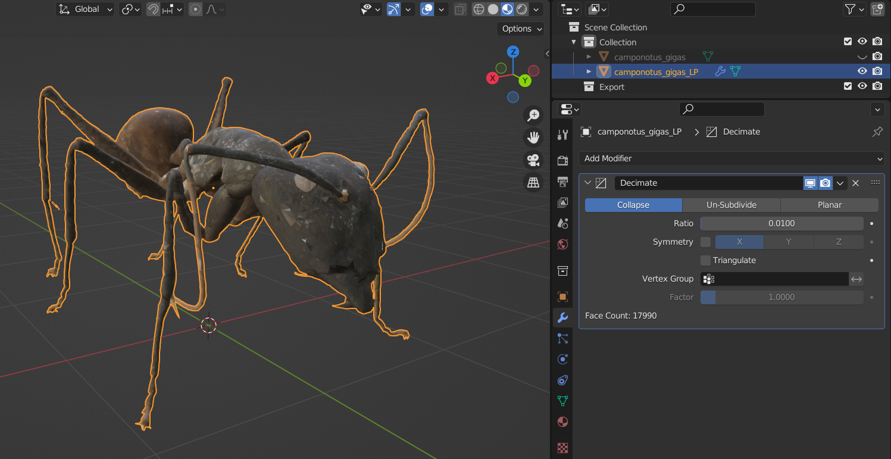

In our example, we start out with close to 2 million faces and a ratio of 0.01 brings us to the desired
**< 20,000** faces.

Once you have reached an appropriate face count, **Apply** the modifier.

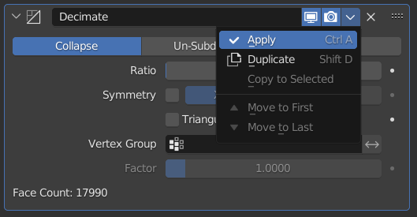

Next, we need to create a new texture which will hold our baked texture map for the low-poly model.
Open a new **UV Editor** panel...

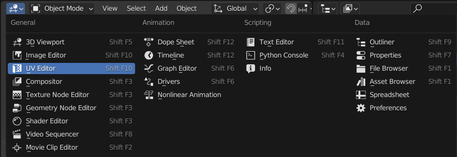

... and create a new image texture.

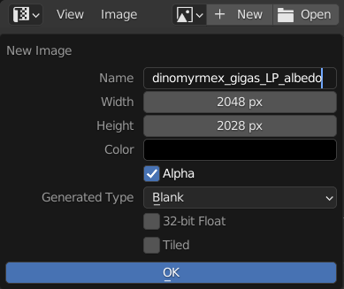

Make sure to save out the created texture to your drive.

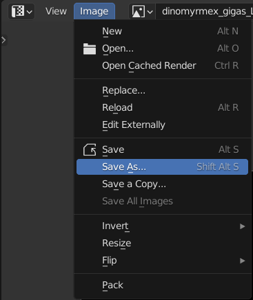.

In the **Material tab** of your **low poly** model, remove all currently existing materials.

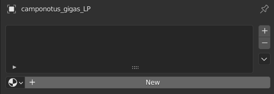

Now, add a single new material, and assign the created empty texture as the base colour. To do so, after clicking on
**New** in the material tab, open a panel with a **Material Editor**, create a new **Image texture** node, select your
created empty texture (the texture that is currently open in your project, not the saved out file), and connect the node
to the **Base Color** input of the **principled shader**.

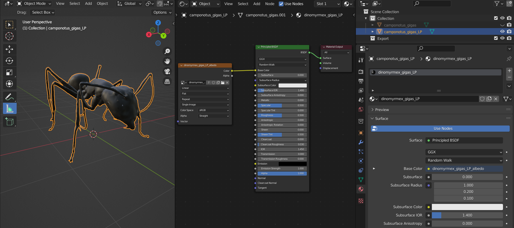

Next, we need to cleanly unwrap the low poly model before baking the texture information of the original model onto it.
With the low poly model selected, go into **Edit Mode** (press tab), and press **A** so all vertices of the model
are selected. Then press **U** and select **Smart UV Project** (leaving all values at default).

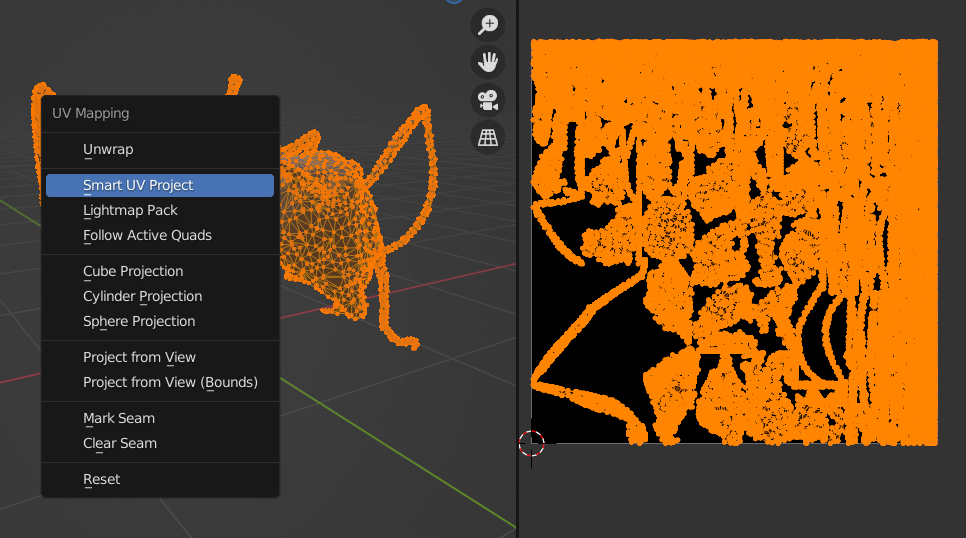

### Texture Baking

Before we get to **bake** (project the colour information from the original to the low poly version),
we first need to set up the correct **scene** and baking parameters. First, make sure you have selected
**Cycles** as your rendering engine.

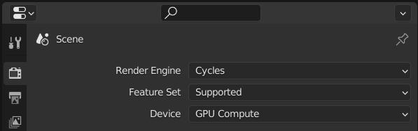

As your **Device** select **GPU Compute** if available.

Then, within the **Render properties** scroll down to the **Bake** tab and apply the following settings

* **Bake Type** : Diffuse
* **Influence** : Color (enable **non** of the other options)
* **Selected to Active** : Check
* **Extrusion** : 0.02 m (in previous versions this was controlled by the **Max Ray Distance**)

#### Note:

In case your model appears "patchy" after the baking process, try adjusting the **Extrusion** value.
* black spots : increase extrusion
* overlapping textures : decrease extrusion

For the next set of steps it is **absolutely vital** that you execute them in the **correct order**, so that Blender knows
which model and texture are considered "selected", and which "active":
1. Open the **material** of the **original** model in the **Shader Editor**. Click on the **image texture node**. 
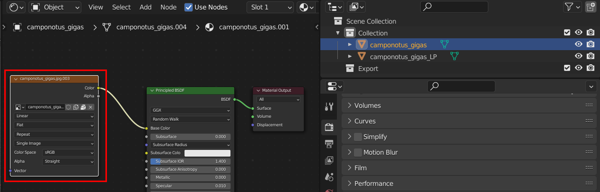
2. Open the material of the **low poly** mesh and also click on the **image texture node**.
3. In the 3D viewport, go into **Object Mode**. 
4. Select the original mesh *(“selected”)*
5. Hold **SHIFT** and select the low poly mesh *(“active”)*
   (You can also perform the selection by clicking in the **Outliner**)
      
6. Press **Bake**, and hope for the best. 

Check the progress bar at the bottom of the screen.

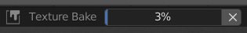

You should now see, in both the **UV Editor** and the 3D viewport, that the texture of the original mesh has been successfully
projected onto the low poly mesh.

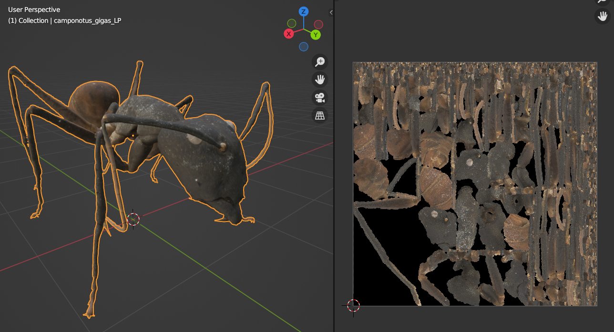

Make sure to (again) save the generated texture to your drive!

### Baking Normal Textures

In order to also bake the surface normals, repeat the process outlined above. Create another image texture and in the
**Shader Editor** create an **Image Texture** node and a **Normal Map** node, to feed into the **Normal** input of the
**Principled Shade** node of your low poly model.

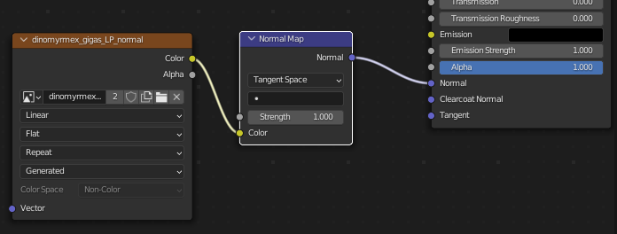

Then repeat the stepes outlined above for baking the texture from the original *("selected")* to the low poly 
*("active")* model, this time selecting **Normal** as your bake type.

Remember to save the generated **Normal** texture to your drive as well!

Now you should have generated the **colour** (or albedo) and **normal** map for your
retolopogised model:

<table style="padding:10px">
  <tr> 
   <td>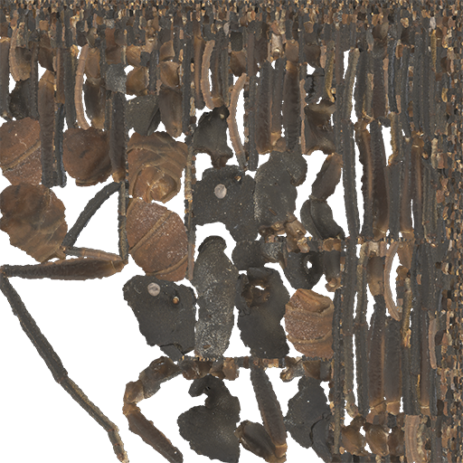</td>
   <td>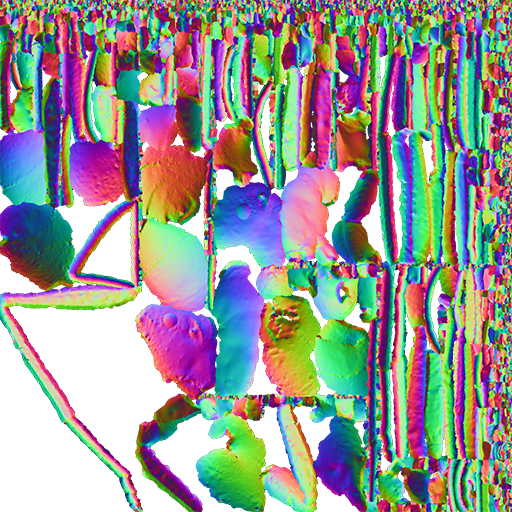</td>
  </tr>
  <tr> 
   <td>colour (or albedo) map</td>
   <td>normal map</td>
  </tr>
</table>

( rendered retogologised model with wireframe overlay )

### Next up: 
> [**02 Rigging 3D models**](02_Rigging_3D_models.md)

___

> In case you encounter any problems, consult our [troubleshooting guide](troubleshooting.md), or consider raising an
> **issue** on the replicAnt GitHub page.
 
## License
© Fabian Plum, Rene Bulla, David Labonte 2023
[MIT License](https://choosealicense.com/licenses/mit/)
