# replicAnt

"generating annotated images of animals in complex environments with Unreal Engine"

by [Fabian **Plum**](https://twitter.com/fabian_plum), 
[René **Bulla**](https://twitter.com/renebulla), 
[Hendrik **Beck**](https://twitter.com/Hendrik_Beck), 
[Natalie **Imirzian**](https://twitter.com/nimirzy), 
and [David **Labonte**](https://twitter.com/EvoBiomech) (2023)

___

___

## Rigging 3D models (subjects)

### Requirements:

* [Blender](https://www.blender.org/) (v3.0.1 or later)
* A ([retopologised](01_Retopologising_3D_models.md)) 3D model you wish to add to the generator

Behind every great synthetic dataset stands a great 3D model.
We will assume that you already have a [retopologised](01_Retopologising_3D_models.md) 3D model you wish
to use.

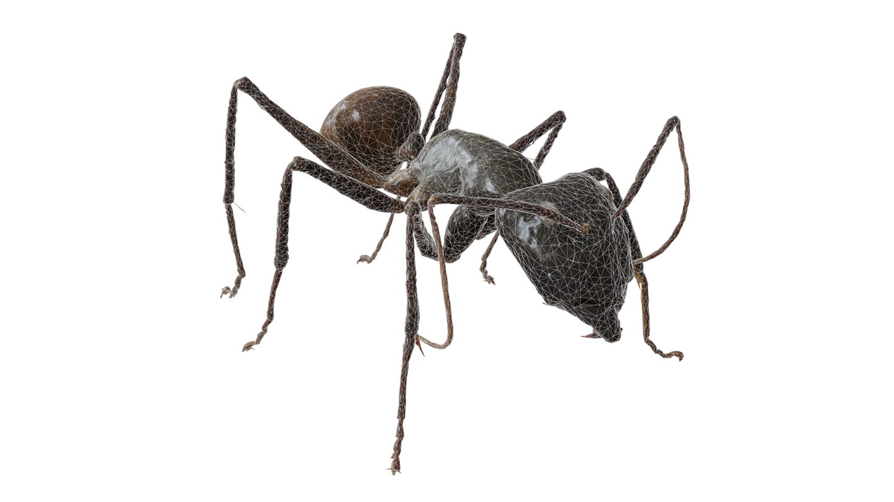

rendering of a [retopologised](01_Retopologising_3D_models.md) low-polygonal 3D model (with a wireframe overlay)

### Important Blender **shortcuts** to make your life (so much) easier:

Now, again: the most important shortcuts to make interacting with blender easier.

Relating to the viewport:

* **Middle Mouse Button**: (*Hold and move your mouse to*) rotate the viewport.

* **Middle Mouse Button + SHIFT**: (*Hold and move your mouse to*) translate the viewport.

* **num-pad keys**: Moves the viewport to a pre-defined position.

The following shortcuts work in any blender panel, so they are useful to remember:

* **G**: Move – move a selected object around. Click the left mouse button to confirm the new position.

* **S**: Scale – scale a selected object up or down. Here, this will help you to adjust the size of the tracking marker.

* **R**: Rotate – rotate a selected object. Adding the rotation of a marker can help retain its identity across frames.

You can also add constraints to the above commands to specify their effect. *After* pressing any of the keys above you
can additionally use:

* **X** / **Y** / **Z**: Restrict the axis in which you are performing the action.

* **CTRL**: Jump between whole number steps

* **SHIFT**: Perform the change in finer increments. Helps a lot when making small changes.

You always confirm your change by clicking the **LEFT Mouse Button**.

* And, of course, **CTRL** + **Z** is your friend to revert your last steps (we all make mistakes). By default, you can go back **32 steps**,
  but you can increase that number under **Edit/Preferences…/System** menu, if you want/need to.

For a handy "cheat-sheet", have a look
at [Blender 3.0 Shortcuts](https://projects.vrac.iastate.edu/reu2022/wp-content/uploads/Blender-3.0-Shortcuts-v1.2.pdf)

For a "not-so handy HotKeys In-depth Reference", refer to the
official [HotKeys In-depth Reference](https://download.blender.org/documentation/BlenderHotkeyReference.pdf)

### Rigging workflow

To make use of our provided animation blueprints, follow
our [standard rigging convention](../example_data/base_rig.blend).

 

In theory, any model and rig combination is possible. Make sure, your model is posed with all legs/equivalent in ground
contact in a somewhat natural pose. This is important, as we are going to use IK solvers to have the appendages
interact with elements in the generated environment.

In this guide we will only cover **rigging** using our pre-configured armature. More advanced users may wish to create
their own custom **armatures** and blue-prints.

#### Bringing the pre-configured armature into your project

Open the **Blender** project file containing your [retopologised](01_Retopologising_3D_models.md) 3D model and in click 
on **File > Append**. Navigate to the **example_data** directory and select the **base_rig.blend** file.

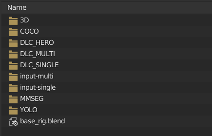

Navigate to the **Objects** folder, select the **Armature** and import it.

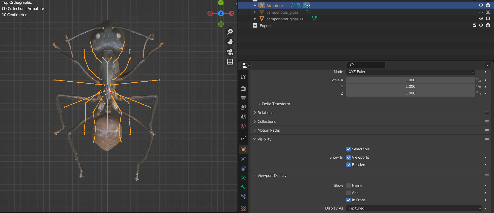

The **Armature** should now be loaded into your scene at the **world origin**.
Next, select the **Armature** and switch into **Edit Mode** to begin moving the set of virtual bones into their desired 
location on the model.

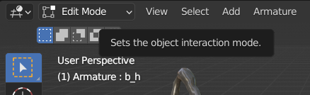

Now (in **Edit Mode**), select the entire **Armature** (with **A**) and move it upwards to roughly align with the centre
of your model.

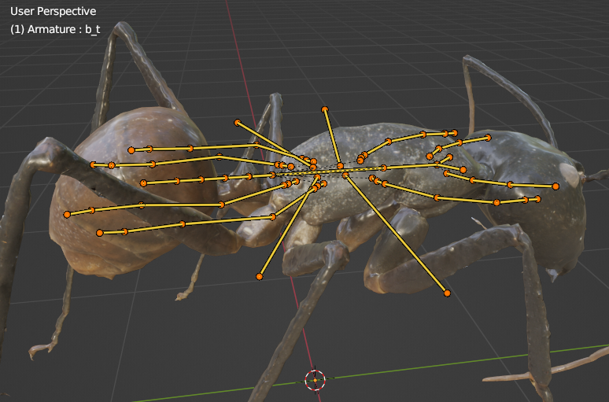

Next, we activate **Snap To** > **Volume** so that the joints we move automatically snap to the centre of the 
surrounding mesh. Make sure to also select **Snap With** > **Center**, as the default is **Closest**.

Furthermore, make sure "X mirror" is turned off while editing. Otherwise, any adjustment made will affect the
respective joints (left and right) on both sides of the Armature.

Now, one by one, select each joint and move it to their desired location. Refer to our reference figures below:

> #### NOTE:
> Take your time with the placement of joints. The more accurately you assign them in your model, the more realistic the
resulting poses will be. You can always go back and refine their position, but you may have to repeat the **weight 
painting** process detailed below afterward.

 

(*Joint naming convention details*)

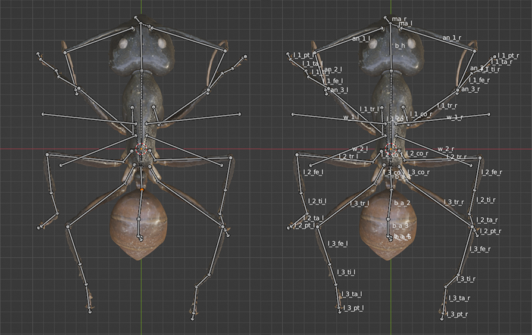

(*top-down view of the assigned Armature*)

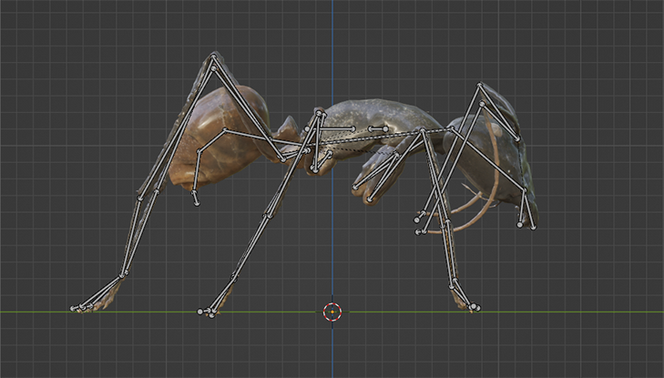

(*side view of the assigned Armature*)

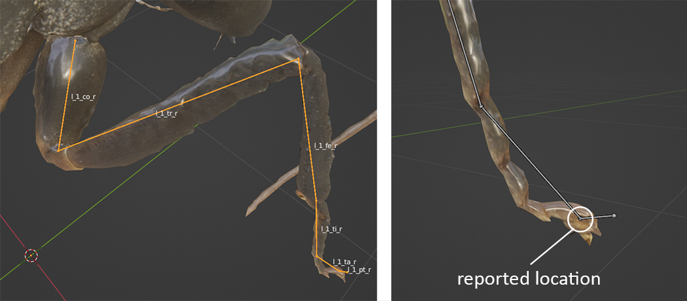

(*Close-up of the end configuration of each leg. As the generator reports back only the location of the
**base** of each bone, the tail end of every chain of bones may lie outside the model*)

After you have completed the joint placement process, we can now **parent** the 3D model (mesh) to the
**Armature**. 

First, select the 3D model, then, while holding **SHIFT**, select the **Armature**.

Now, press **CTRL + P** and select **Armature Deform** > **With Automatic Weights**.

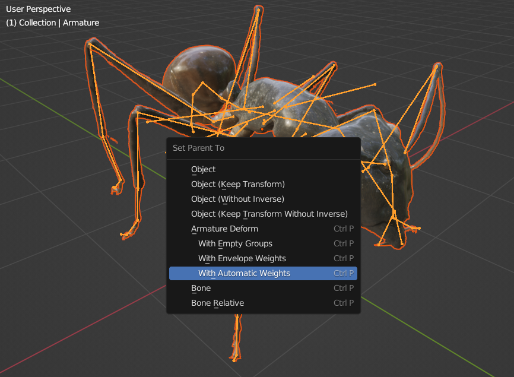

Finally, select your 3D model and switch into **Weight Painting** mode. On the right side open the **Vertex Group**
panel and, one by one, check that every virtual **bone** only affects the desired area. If it also affects adjacent
areas of the mesh, use the **Add** and **Subtract** brushes to paint in the areas correctly.

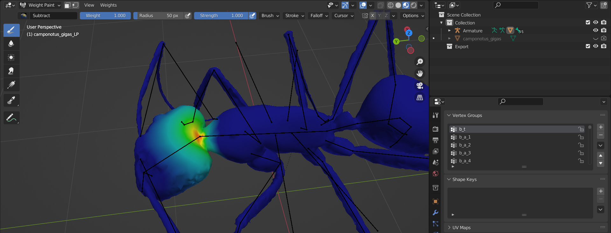

Be **very** diligent with this final step, as otherwise your model will not deform correctly inside the 
generator, and everyone will be disappointed.

When you are done, select the **Armature** and switch into **Pose Mode** to ensure all joints behave as expected and only
affect the desired areas of the mesh!

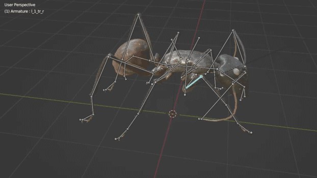

### Next up:

> [**03 Bringing 3D_models into Unreal**](03_Bringing_3D_models_into_Unreal_guide.md)

___

> In case you encounter any problems, consult our [troubleshooting guide](troubleshooting.md), or consider raising an
> **issue** on the replicAnt GitHub page.
 
## License
© Fabian Plum, Rene Bulla, David Labonte 2023
[MIT License](https://choosealicense.com/licenses/mit/)
