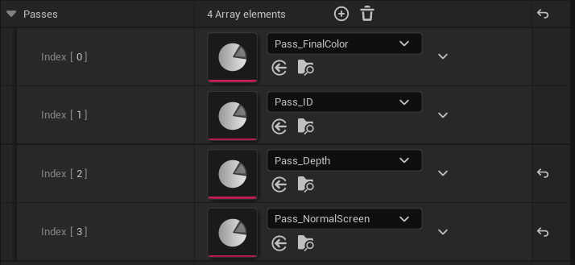
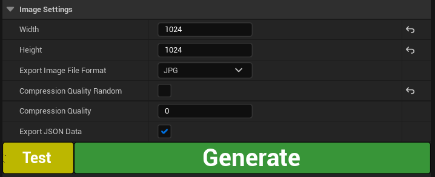
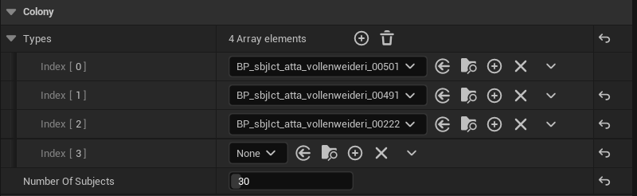

# FARTS

**F**abi **A**nd **R**ené's **T**raining-data **S**ynthesizer

Generating synthetic datasets to improve inference on all sorts of computer-vision tasks that specifically involve
insects. Like, lots of them.

## Generating your first dataset

### Requirements:

* Unreal engine (installed via Epic Games Launcher, see above, v5.0.2 or later)
* Your [retopologised](01_Retopologising_3D_models.md) and [rigged](02_Rigging_3D_models.md) subject 3D model(s)
  [brought into Unreal Engine](03_Bringing_3D_models_into_Unreal_guide.md)

### Basic configuration

#### The FARTS User Interface

*For details (also, regarding which settings have been used in our examples) refer to the official publication*

* use **Content/Generator_config/Generator_example.umap** as a starting point for your new configuration

1. open the FARTS Interface (in case it is not already loaded)

2. General

Iterations

passes

image settings

Randomisation updates

3. Subjects

Adding / Switching subject models

Preview colony / purging subjects

4. Environment

5. Debug

6. Hit generate -> now what?

 

* refer to parsers to turn datasets into something trainable

### Advanced settings

* changing subject size
* changing camera settings
* custom animation blueprints
* configure scene lighting
* configure asset scatterers

### Next up:

> [**05 Adding custom assets and scatterers**](05_Adding_custom_assets_and_scatterers.md)