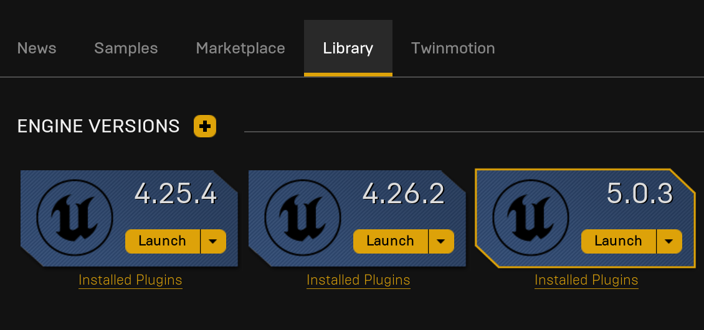
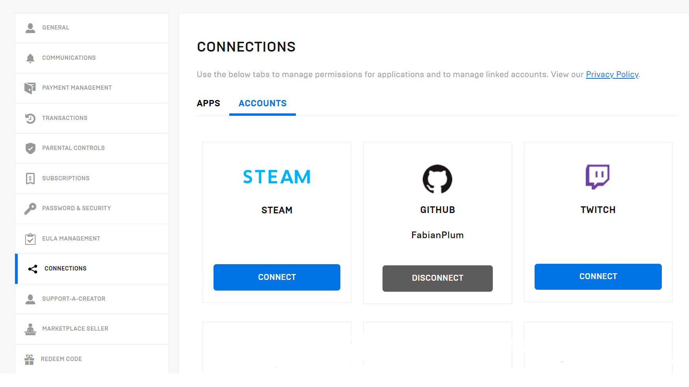
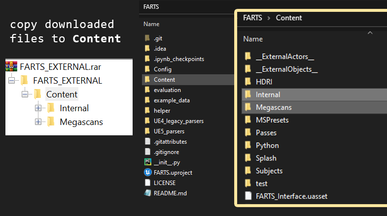
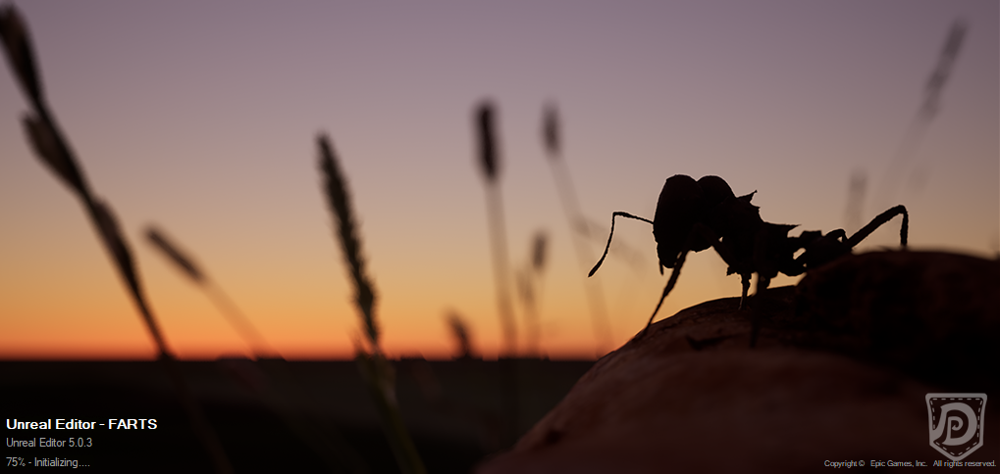

# replicAnt

"generating annotated images of animals in complex environments with Unreal Engine"

by [Fabian **Plum**](https://twitter.com/fabian_plum), 
[René **Bulla**](https://twitter.com/renebulla), 
[Hendrik **Beck**](https://twitter.com/Hendrik_Beck), 
[Natalie **Imirzian**](https://twitter.com/nimirzy), 
and [David **Labonte**](https://twitter.com/EvoBiomech) (2023)

___


___

## Installing Unreal Engine
### Minimum system requirements:

*	Windows 10 (other operating systems may work but are untested)
* ~ 50 GB of disk space (the faster the better)
  * Unreal engine itself will occupy roughly 30 GB
  * Another ~5GB for the complete project including 3D assets and materials
  *	~5 GB per 10k sample dataset at 2k resolution (when using all available passes)
*	Dedicated GPU with 6GB VRAM (currently, only tested on NVIDIA GPUs)
*	16 GB RAM

### Unreal Installation Guide
1.	You will first need to create an [Epic games account](https://www.epicgames.com/site/login) which we will later link to your Github profile. This grants you access to the Unreal Engine source code, including Blender Plugins (i.e., Send2Unreal), and as a bonus, grant access to Quixel’s asset library to add additional meshes and materials to your generator environment:

[Epic Games account creation](https://www.epicgames.com/site/login)

2.	Download and install the Epic Games Launcher. From there, you can manage your (to be) installed Unreal Engine environments and update them:

[Epic Games Launcher](https://www.epicgames.com/site/en-US/home)


3.	Open the installed **Epic Games Launcher** and click on **Unreal Engine** on the left side of the window.


Now, click on **Library** and click on the **+** icon to install a new version of Unreal Engine. As we built replicAnt on Unreal Engine 5, select the latest Unreal Engine 5.0 release, and follow the installation guide (Issues have been reported with builds later than 5.1 which we are currently investigating)

Unless you are planning on running extensive debugging or further development, only selecting **core components** should be sufficient. All additionally required functionality is provided in our project environment and, alternatively, can be installed later on.



4.	While your computer is busy installing Unreal Engine, connect your GitHub account to your newly created Epic Games account. For a more thorough guide, refer to the (official documentation](https://www.unrealengine.com/en-US/ue-on-github)

In short, head over to your [Epic Games account]( https://www.unrealengine.com/account/connections), and under **Connections**, connect to your GitHub profile. Simply follow the instructions prompted in your browser and authorize Epic Games. You will then receive a confirmation email to join the Epic Games organisation on GitHub to access all source code and plugins.



If all has gone well, you should be able to see on your GitHub profile that you have successfully joined Epic Games!


5.	Once the **Unreal Engine** installation has completed in the background, restart your computer. Afterwards, we’ll set up the project.

###Setting up the replicAnt project
1.	If you have not done so already, clone the replicAnt repository to your computer. The total project size will be ~5GB, including 3D assets and materials to populate the procedurally generated world.

```bash
git clone https://github.com/FabianPlum/replicAnt
``` 

This will take a while. There are a lot of files to be copied.

2.	Once the download has finished, you will next need to download all additional assets (3D meshes and materials) we have provided externally. NOTE: This project is running under a non-commercial license and any assets used for the generation of synthetic datasets may not be used or re-distributed for commercial purposes.

[Download replicAnt external content files](https://drive.google.com/file/d/1h6p040Gy7vvwY12C7zOBdEdjgBTOihhO/view?usp=sharing)

Download and unpack the files into the **Content** directory of the replicAnt project.



3. Launch **replicAnt.uproject** by double-clicking on the file. When opening the project for the first time, it may take up to 30 minutes to compile all shaders. If this is the case you can use the spare time to install [Blender](https://www.blender.org/) and the latest version of [Send2Unreal](https://github.com/EpicGames/BlenderTools/releases). 



4. In the content browser, right-click on the file named **FARTS_Interface** and select **Run Editor Utility Widget**.


Now, you should be able to see the FARTS interface on the left side of your screen, where you can configure everything part of the generator, from file types and simulated colonies, to adding further animals, and controlling the generator seed for benchmarking and debugging purposes.


In theory, you can now start generating your first datasets right away (if you are planning on only using the provided insect models). In case you want to bring your own insect models into the generator follow the [3D model to dataset guide](03_Bringing_3D_models_into_Unreal_guide.md).

___

> In case you encounter any problems, consult our [troubleshooting guide](troubleshooting.md), or consider raising an
> **issue** on the replicAnt GitHub page.
 
## License
© Fabian Plum, Rene Bulla, David Labonte 2023
[MIT License](https://choosealicense.com/licenses/mit/)
