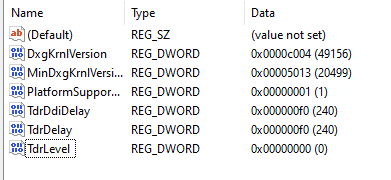

# replicAnt

"generating annotated images of animals in complex environments with Unreal Engine"

by [Fabian **Plum**](https://twitter.com/fabian_plum), 
[René **Bulla**](https://twitter.com/renebulla), 
[Hendrik **Beck**](https://twitter.com/Hendrik_Beck), 
[Natalie **Imirzian**](https://twitter.com/nimirzy), 
and [David **Labonte**](https://twitter.com/EvoBiomech) (2023)

___


___

# Troubleshooting

## 1. Unreal Engine Randomly Crashes

There are plenty of reasons WHY Unreal may crash with seemingly random error codes pointing to 
any of a large number of **EXCEPTION_ACCESS_VIOLATION** addresses. A joy. Here is a compilation of the most common fixes.

### 1.1 Decreasing the number of meshes in the scene

A simple fix, which often does the trick on systems with limited **RAM** or **VRAM**, is to decrease the number
of meshes (and/or their complexity) which simultaneously occupy memory in your scene. This can be done by changing one of
the following three parameters:
1. **Tesselation level** - Decrease the **Tesselation Level** in the **User Interface** > **Environment** tab. The
default level of ```30``` (influencing the number of subdivision and thus mesh complexity of the ground plane) is too
high for some systems.
2. **Asset Scatterers** - Decrease the range of **assets** each asset scatterer can spawn.
In some instances, the system may have sufficient RAM / VRAM to load all scattered assets, but the Unreal
Instance has an upper limit as to how many objects can persist in a scene concurrently.
3. **Colony size** - this is arguably the last parameter you may want to change - the number of subjects can greatly affect the quality of the synthetic data. However, decreasing the number of subjects can aid in improving the system stability.

### 1.2 Switching to legacy versions of DirectX
In case of frequent crashes (Windows 10 & 11 OS) which scream EXCEPTION ACCESS VIOLATION of all sorts of read & write addresses, 
consider switching from DirectX 12 to DirectX11:

In the **Unreal Engine Project Settings > Platforms - Windows > Targeted RHIs**, set the Default RHI to DirectX 11

**WARNING:**  Switching to DirectX 11 is a temporary fix, as the rendering performance and image quality of the resulting 
samples may decrease. As this is a Windows system issue, we cannot provide support or a specific timeline of when the 
underlying issue will be addressed. Sorry. Complain to Bill!

### 1.3 Editing registry entries

Editing registry entries can help to avoid that applications are not terminated by rendering delays. Open the **Registry Editor**
and edit the following entries under ```Computer\HKEY_LOCAL_MACHINE\SYSTEM\CurrentControlSet\Control\GraphicsDrivers```



**TdrLevel** - Specifies the initial level of recovery.

      KeyPath   : HKEY_LOCAL_MACHINE\System\CurrentControlSet\Control\GraphicsDrivers
      KeyValue  : TdrLevel
      ValueType : REG_DWORD
      ValueData : TdrLevelXxx (see the following table)

Where TdrLevelXxx can be one of the following values:

```ValueMeaningTdrLevelOff (0)``` - Detection disabled

```TdrLevelBugcheck (1)``` - Bug check on detected timeout; for example, no recovery.

```TdrLevelRecoverVGA (2)``` - Recover to VGA (not implemented).

```TdrLevelRecover (3)``` - Recover on timeout. This is the default value.

**TdrDelay** - Specifies the number of seconds that the GPU can delay the preempt request from the GPU scheduler. 
This is effectively the timeout threshold.

      KeyPath     : HKEY_LOCAL_MACHINE\System\CurrentControlSet\Control\GraphicsDrivers
      KeyValue    : TdrDelay
      ValueType   : REG_DWORD
      ValueData   : Number of seconds to delay. The default value is 2 seconds.
      
**TdrDdiDelay** -  Specifies the number of seconds that the OS allows threads to leave the driver. 
After a specified time, the OS bug-checks the computer with the code VIDEO_TDR_FAILURE (0x116).

      KeyPath   : HKEY_LOCAL_MACHINE\System\CurrentControlSet\Control\GraphicsDrivers
      KeyValue  : TdrDdiDelay
      ValueType : REG_DWORD
      ValueData : Number of seconds to leave the driver. The default value is 5 seconds.

### 1.4 Disabling background tools influencing GPU performance

If you experience frequent crashes without an apparent source of error, try uninstalling (or temporarily deactivating) 
any tools that may check on GPU usage or influence clock-speed, memory usage, etc.
> **Common culprits are**:
> * TechPowerUp GPU-Z
> * MSI Afterburner
> 
> (_**NOTE**: This list is (almost certainly) not complete. If you find further applications that influence the
> generator performance, please raise an **issue** and let us know, so we can expand this list!_)

### 1.5  (files specific to UE 5.03)

In case you are encountering GPU crashes accompanied by the following message:

**GPU crashed or d3d device removedf use -d3ddebug to enable the d3d debug device**

Replace the following .dll file in your Unreal Installation:
1. go to ..\UE5\Engine\Binaries\Win64\UnrealEditor-D3D12RHI.dll and either rename the file or back it up in an external directory
2. download the following zip file: https://forums.unrealengine.com/uploads/short-url/q2x7oamoQBUvYu0iMHLXfEPZCyy.zip
3. extract the downloaded .dll in the place of the original file


> In case this does not fix the issue, make sure to revert back to the original .dll file!
> 
> _fix discovered in the [Unreal Dev Community Forum](https://forums.unrealengine.com/t/ue5-gpu-crashed-or-d3d-device-removed/524297/50)_


---

### Found a Fix? Let us know!
> **If you discover further methods to counter frequent crashes, please raise an issue to let us know, so we can add your
discoveries to our troubleshooting guide!**

---


## 2. "root" bone in armature prevents assigning skeletal mesh

As of **Blender 2.93.2**, the following solution which allows you to use ANY name for your armature and export without
the extra bone should apply:

Source: [Prevent Blender FBX Exporter adding extra root bone](https://forums.unrealengine.com/t/tutorial-how-to-remove-extra-root-bone-from-blender-armature-and-retarget/409535)

1. Download and install Notepad++ 13 or another editor.
2. Navigate to the “io_scene_fbx” folder in your Blender installation directory.

```bash
  e.g. .../blender-2.93.2-windows-x64/2.93/scripts/addons/io_scene_fbx
```

3. **IMPORTANT**: Create a back-up copy of the file “export_fbx_bin.py” on your Desktop or somewhere else in
   case you make a mistake or want to go back to the previous behavior.
4. Now double-click and open “export_fbx_bin.py” with Notepad++ or your preferred editor.
5. As of **Blender >2.93.2**, you should see the following on lines ```2575 to 2577```:

```bash
      2575:  elif ob_obj.type == 'EMPTY' or ob_obj.type == 'ARMATURE':
      2576:     empty_key = data_empties[ob_obj]
      2577:     connections.append((b"OO", get_fbx_uuid_from_key(empty_key), ob_obj.fbx_uuid, None))
 ```

6. Comment out these lines by adding a “#” at the start of each:

```bash
   2575: #elif ob_obj.type == 'EMPTY' or ob_obj.type == 'ARMATURE':
   2576: #   empty_key = data_empties[ob_obj]
   2577: #   connections.append((b"OO", get_fbx_uuid_from_key(empty_key), ob_obj.fbx_uuid, None))
 ```

7. Save the “export_fbx_bin.py” file in Notepad++ or your editor.
8. Restart Blender.

___

> In case you encounter any problems, consult our [troubleshooting guide](troubleshooting.md), or consider raising an
> **issue** on the replicAnt GitHub page.
 
## License
© Fabian Plum, Rene Bulla, David Labonte 2023
[MIT License](https://choosealicense.com/licenses/mit/)
